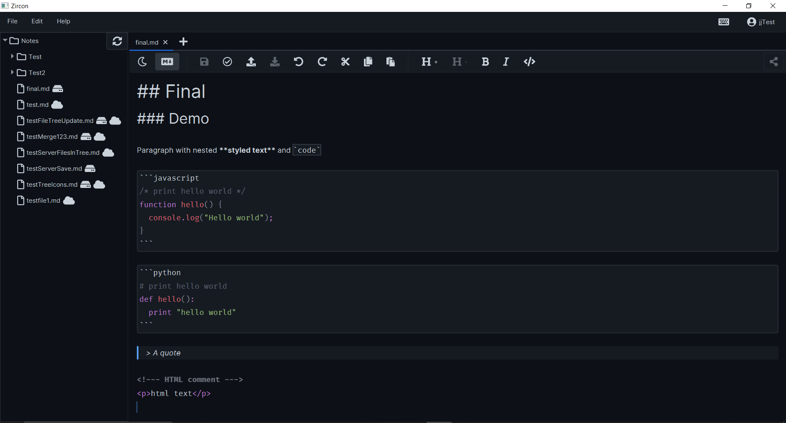

# Markdown Editor

## Group Members
Joshua Johnson, Mihran Mashhud, Tony Tascioglu, Mrugank Upadhyay, Eddy Guo

## Usage
In /launcher:
1. `package` to create executable
2. `md [file1] [file2] ...` to run application

	- the file arguments are optional and must be specified with their absolute path

There is no need to build the backend.

Important: After running package, if the `md` command fails, run `package` again then try `md`.
	
- There is a weird bug where build does not work properly on first try, but works fine after second

## Extensions Implemented
- Tony + Mrugank + Joshua: Save notes to server and sync using it as well
- Tony + Mrugank: User Authentication and Autologin
- Tony + Mrugank: Allow users to share notes with each other
- Eddy: Autosave document
- Mihran: Code block and HTML syntax highlighting. Syntax highlighting support is for the following (more can be added in future builds):
	- JavaScript, Python, HTML
- Joshua: File tree menu to quickly open, rename, and delete files. It also shows status of files (whether they exist locally and/or on the server)
- Eddy: Custom hotkey menu to edit hotkeys for various functions such as save, create new tab, bold, etc
- Tony + Mrugank: Export to HTML and PDF

## Releases
### 0.1 - Sprint 1
- Joshua: Developed initial document UI with a top level menu bar
- Mrugank & Mihran: Initial implementation of Rich Text text area
- Tony & Mrugank: Implemented Springboot backend, which serves http Rest API requests
- Tony & Mrugank: Create test API endpoints with JSON encoding
- Tony: Configured database connection to MySQl with JDBC

### 0.2 - Sprint 1.5 & 2
- Joshua: Custom package (distZip) and md (console launcher) scripts - OS agnostic
- Eddy: Implement initial create, open and save files - scheduled for Sprint 1
- Joshua & Mrugank: Further integrate create, open, and save functionality (with abstraction)
- Joshua: Initial file tree
    - Custom with cell factory to allow opening files
- Tony & Mrugank: Client-side API calls for create, open, save
- Mrugank & Joshua: Log in and register client UI
- Mihran: Parse Markdown into AST
- Mihran: Add basic markdown syntax support and styling for the following:
    - Headings, Links, Bold, Italics, Block quotes, Code & code blocks (uses Fira Code for font)
- Mihran: Theming - Togglable light & dark themes, and update application main font to Inter
- Mihran: Persistent settings. (for now saves theme) - OS agnostic
- Tony & Mrugank: Server-side Notes API endpoints (SQL queries with JDBC)
    - Load/save notes, list of notes for a user
	- Get contents of a note using an inner join
	- Create new note on the database with dual SQL queries
- Tony: Server side user authentication
	- Log in (checks user and password) and register (checks email with regex)
	- Use user tokens (assign on log in and register, authenticate on save/load)
	- Implement BCrypt for password hashing and salting
- Mrugank: Client side user authentication (log in and register)
    - JSON deserialization on client side

### 0.3 - Sprint 3
- Mrugank: Convert endpoint retrieval to use JSON between server and client and recreate Note and Share data class
- Mrugank: Implemented rename functionality and bug fixes
- Mrugank: Implemented file deletion from local and server
- Mrugank & Tony: Implemented Share Menu UI and api endpoints
- Mrugank: Implemented Autologin feature
- Mrugank: Implemented hotkeys for undo, redo, cut, copy, paste
- Joshua: Integrated server save as a user-accessible button
- Joshua: Further integrate login and registration flow
- Joshua: Implemented renaming local files from file tree
- Joshua: Implemented file tree resizing, refresh, and graphics
- Joshua: Dynamically add unsaved indicators to file tabs
- Joshua: Integrated server files in file tree
	- Including integration with existing functionality for local files
- Tony: Server backend for note sharing
	- Share note (and lookup shared user to email, etc)
	- DB queries to handle multiple users using a note (many-many relation)
	- List shares for file, delete share endpoints
	- Allow reading and saving notes from shared users with R/RW access
- Tony: Rename and delete file server backend and DB queries + endpoints
- Tony: Refactor all API endpoints to return JSON
	- Return status string to communicate errors with frontend
- Tony: Switch to HTTPS (TLS) encryption for server calls
	- Nginx as reverse proxy and load balancer
	- Install HTTPS certificate from LetsEncrypt
- Eddy: Implemented auto-save functionality - scheduled for Sprint 2
- Eddy: Implemented keyboard shortcuts for window functionality
- Mihran: Made editor text area use AtlantaFX theming for all its colors.
- Mihran: Styled the following elements: Code blocks and inline code, Block quotes, Ordered and unordered, lists, HTML, HTML comments, Links
- Mihran: Created Buttons to toggle delimiters of bold, italics, and code inlining.
- Mihran: Created Buttons to increase and decrease heading depth.
- Mihran: Implemented preview & raw view modes.

### 0.4 - Sprint 4
- Mihran: Code block and HTML syntax highlighting
- Mihran: Add shortcuts for bold, italic, and heading
- Mrugank: Implemented markdown to pdf
- Tony: Implemented markdown to html
- Mrugank & Tony: JUnit testing (40+ tests)
	- User API testing: Login, and Register
	- Note API testing: get list, save, open, create, rename, and delete
	- Note sharing API testing: get share list, share, and unshare
- Joshua: Added file tree indicators (icons) for local and server
- Joshua: Refresh file tree after login, logout, save, upload
- Joshua: Integrate opening files as CLI parameters
- Joshua: General bug fixes
	- File tree, tooltips, window sizes, autosave, share button, tabs only open once, save
- Joshua: Implemented download button
- Joshua: Implemented merge conflict window
- Eddy: Custom hotkey configuration - scheduled for Sprint 3
- Eddy: Bug fixes for autosave

